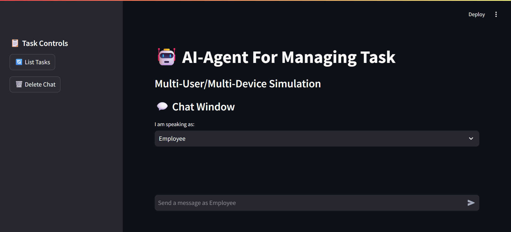
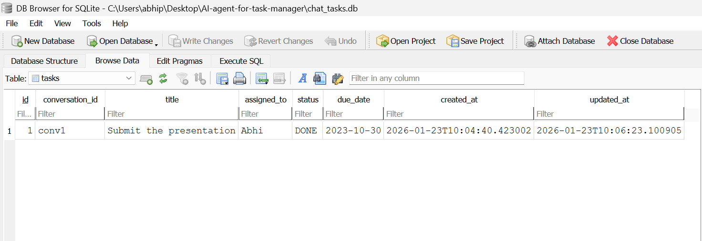

# AI-Powered Conversational Task Manager
  
 
 

This is an AI-driven task management assistant built using LangChain, Python, and SQLite.
It enables users to manage tasks through natural language conversations, acting as a smart productivity layer that understands instructions, tracks progress, and maintains conversation history.

##  Features
- **Conversational Task Creation** – Add tasks with title, assignee, and due date using plain English.
- **Task Status Management** – Update task states such as OPEN, INPR (In Progress), DONE seamlessly.
- **Task Listing via Chat** – Retrieve all tasks within a conversation context.
- **Conversation Lifecycle Control** – Delete entire conversations along with associated tasks and messages.
- **Context-Aware Assistant**– Understands natural language commands and maps them to task operations.
- **Persistent Memory** – Stores tasks and chat history for continuity across sessions.
- **Modern Chat UI** – built with Streamlit’s `st.chat_message`, avatars, and expanders.

---

**File Explanations:**

- **demo.py**:  
  This is the main entry point of the application. Running this file launches the interactive Command line interface where users can manage their tasks via natural language.

- **db.py**:  
  Contains all the functions to **interact with the SQLite database**, including creating tables, inserting new tasks,deleting conversations, updating task status, and retrieving task list.

- **tools.py**:  
  Implements the **task management tools** that the AI agent uses to execute user commands, such as adding new tasks, listing current tasks, updating the tasks.

- **agent.py**:  
  Sets up the **LangChain AI agent**, defines how it interprets user instructions, and connects it to the task management tools.

- **chat_tasks.db**:  
  SQLite database file where all **tasks, messages, and conversation history** are stored .

##  Example Commands  
- `Employer: Abhi,you have to submit the assignment by Monday`  
- `Employer: Abhi,you also have to submit the PPt by Friday`  
- `You: I have completed the assignment work.`  
- `You: I have also completed the PPt work.`  
- `Employer: Show me all tasks.`  
  
